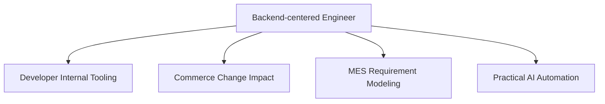
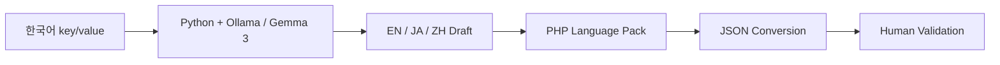

# AI-assisted Engineering / Internal Tools / AX

AI 도구를 많이 사용했다는 사실보다 **어떤 문제에 AI를 쓰고, 어디부터 일반 코드와 사람의 판단으로 경계를 나눴는지**를 보여줍니다.

## Portfolio map



| Case | Problem | Decision | Evidence |
|---|---|---|---|
| Developer Internal Tooling | 반복되는 프로젝트 설정과 drift | 반복 비용이 생기는 경계만 typed module로 공통화 | harness-kit public code/CI |
| Commerce Change Impact | 화면 증상이 상태·배치·외부연동까지 연결 | 코드 변경 전에 blast radius 탐색 | sanitized career case |
| MES Requirement Modeling | 모호한 현장 요구가 시스템 규칙을 숨김 | 실제 업무순서를 상태·조회·권한·DB 조건으로 분해 | sanitized career case |
| Practical AI Automation | 번역·복사·코드입력 반복과 작은 모델의 한계 | 자연어만 Local LLM, 파일 변환은 deterministic code, 최종 검수는 사람 | sanitized actual-use case + public workflow evidence |

---

## Practical AI Automation

### Problem

다국어 언어팩 작업에서 번역기 실행, 결과 복사, 코드 입력, 파일 변환을 언어별로 반복해야 했습니다.

### Constraints

- 전용 GPU 없는 내부 PC
- 소형 Gemma 3 모델
- 처리 속도와 번역 품질 한계
- 완전 자동 번역 품질을 보장할 수 없음

### Decision



- **LLM:** 자연어 번역 초안
- **Deterministic code:** key/value 구조 보존, PHP 언어팩 생성, JSON 변환
- **Human:** 번역 맥락·오역 확인, 최종 반영 판단

프론트 개발자가 실제 언어팩 작업에 반복 사용했지만 생산성 향상률, 정확도 %, 비용 절감률은 측정하지 않았으므로 주장하지 않습니다.

[Deep dive →](cases/practical-ai-automation.md)

---

## Verification principle

```text
Model response != Completion evidence
```

Agent가 테스트를 skip하거나 fail/not_run 상태를 충분히 보고하지 않는 경험 이후, 시나리오·실행 결과·체크리스트와 실제 산출물을 완료 판단에 포함했습니다.

```text
Problem / Scope
→ AI-assisted work
→ Static / Test / CI
→ Independent review
→ Human acceptance
```

UI/UX와 실제 사용자 동선, 운영 영향처럼 자동화만으로 판단하기 어려운 항목은 사람이 직접 확인합니다.

---

## Public evidence

- [harness-kit](https://github.com/tomtomjskim/harness-kit)
- [codex-workflow-skills](https://github.com/tomtomjskim/codex-workflow-skills)
- [stackforge-atlas](https://github.com/tomtomjskim/stackforge-atlas)
- [claude-code-guide](https://github.com/tomtomjskim/claude-code-guide) — selective supporting evidence

Representative hold status is tracked separately in [EVIDENCE.md](EVIDENCE.md).
