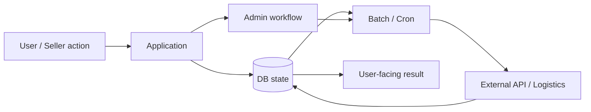

# Commerce / Logistics — Change Impact in a State-Heavy System

## Problem

운영 중인 커머스·물류 시스템에서 사용자에게 보이는 상태는 단일 화면이나 단일 테이블만으로 결정되지 않을 수 있습니다.



화면 조건만 수정하면 후속 처리와 상태가 더 어긋날 수 있습니다.

## Context / constraints

- 장기간 운영된 PHP 업무시스템
- 상품·입고·재고·외부출고·관리자 기능 등 상태 중심 흐름
- file-based 외부 주문 등록의 upload → preview → confirm 단계
- batch/cron과 외부 시스템 경계
- production 데이터와 정확한 내부 architecture는 비공개

## Decision

```text
symptom / request
→ AS-IS code
→ DB structure / state
→ permission
→ admin workflow
→ batch / cron
→ external API
→ downstream effect
→ bounded change plan
```

핵심은 모든 시스템을 다시 설계하는 것이 아니라 **이번 변경과 실제로 연결된 범위를 먼저 찾는 것**입니다.

## Practical questions

- 이 값의 source of truth는 어디인가?
- 누가 상태를 변경할 수 있는가?
- 관리자 처리와 사용자 화면은 같은 조건을 보는가?
- batch/cron이 뒤에서 다시 상태를 변경하는가?
- 외부 시스템 응답이 내부 상태에 영향을 주는가?

## Batch example

외부 주문 등록과 같이 여러 건을 처리하는 기능에서는 업로드 성공과 업무 반영 완료를 분리합니다.

```text
upload
→ preview / validation
→ confirm
→ batch processing
→ completed | failed
```

## Demonstrates

- state-heavy PHP 업무시스템의 변경 영향 분석
- 관리자·권한·batch·외부 API를 변경 범위에 포함하는 판단
- upload / preview / confirm과 batch completion boundary 경험
- proprietary production 정보를 공개하지 않는 evidence boundary

## Does not prove

- 전체 commerce architecture ownership
- canonical/idempotency/signed API/reconciliation 전체 ownership
- production SLA·트래픽·매출 개선 수치
- 고객·주문·결제·배송 raw data
