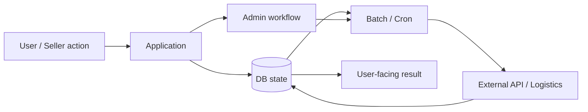

# Commerce / Logistics — Change Impact in a State-Heavy System

## Question

사용자에게 보이는 한 화면의 상태가 DB·관리자·batch·외부 연동에 걸쳐 만들어질 때, 변경 범위를 어떻게 정할 것인가?

## At a glance

| | Summary |
|---|---|
| **Problem** | 화면 증상이 DB 상태·관리자·배치·외부 연동까지 이어짐 |
| **Decision** | UI 수정 전에 상태 변경 주체와 후속 영향을 추적 |
| **Evidence** | 비식별화한 실무 Case와 프로젝트 검수 범위 |

## Problem

운영 중인 커머스·물류 시스템에서 사용자에게 보이는 상태는 단일 화면이나 단일 테이블만으로 결정되지 않을 수 있습니다.



화면 조건만 수정하면 관리자 처리, 후속 batch, 외부 물류 응답과 내부 상태가 더 어긋날 수 있습니다.

## Context / constraints

- 장기간 운영된 PHP/MySQL 업무시스템
- 상품·입고·재고·외부출고·관리자 기능 등 상태 중심 흐름
- 고객·판매자·플랫폼처럼 서로 다른 사용 주체
- file-based 외부 주문 등록의 `upload → preview → confirm` 단계
- batch/cron과 외부 시스템의 비동기 경계
- production 데이터와 정확한 내부 architecture는 비공개

## Investigation

변경 요청을 받으면 다음 질문으로 실제 영향 범위를 좁힙니다.

```text
symptom / request
→ AS-IS code
→ DB read / write path
→ state owner and actor
→ permission
→ admin workflow
→ batch / cron
→ external API
→ downstream effect
```

- 이 값의 source of truth는 어디인가?
- 누가 어떤 조건에서 상태를 변경할 수 있는가?
- 사용자와 관리자 화면은 같은 업무 조건을 보는가?
- batch/cron이 뒤에서 다시 상태를 변경하는가?
- 외부 요청 성공과 실제 물류 처리 완료가 같은 의미인가?
- 고객 처리 마감과 플랫폼-판매자 정산 마감은 같은 책임인가?

## Decision

모든 시스템을 다시 설계하는 것이 아니라 **이번 변경과 실제로 연결된 경계를 먼저 찾고, 그 범위 안에서 상태·권한·후속 처리를 함께 수정**합니다.

고객·판매자·플랫폼의 관계도 한 주문의 단일 상태로 모두 표현하지 않습니다.

```text
customer ↔ seller
order / delivery / confirmation / ordinary claim

platform ↔ seller
settlement judgment / closing condition

seller ↔ platform
withdrawal request / approval / payment status
```

한 컨텍스트의 마감 사실이 다른 컨텍스트의 허용 조건에 영향을 줄 수는 있지만, 같은 상태머신으로 취급하지 않습니다.

## Trade-off

극히 드문 사후 예외를 정상 주문·정산 상태 흐름에 억지로 포함하면 기존 마감 규칙과 권한 조건이 복잡해질 수 있습니다. 현재 시스템이 지원하지 않는 특수 사례는 운영 처리와 향후 별도 기능 후보를 구분합니다.

이는 예외를 무시한다는 의미가 아니라, **정상 흐름의 불변조건을 깨지 않으면서 별도 관리가 필요한지 판단한다는 의미**입니다.

## Implementation

공개 가능한 구현 패턴은 다음과 같습니다.

### 1. 대량 입력의 단계 분리

```text
upload
→ preview / validation
→ explicit confirm
→ batch processing
→ completed | failed
```

- 파일을 읽었다는 성공과 업무 데이터로 반영해도 된다는 판단을 분리
- 사용자 확인 전 필수값·형식·매핑 오류를 노출
- batch 요청과 건별 처리 결과를 구분
- 업로드 완료를 업무 처리 완료로 표시하지 않음

### 2. 역할·상태·정책 조건을 서버에서 재검증

UI 버튼 노출은 편의 기능이며 최종 허용 조건은 backend에서 확인합니다.

```text
actor
+ current state
+ balance / account / policy blocker
→ allowed command
```

### 3. 외부 요청과 내부 확정 상태 분리

외부 API의 즉시 응답, 비동기 진행, 실패, 결과 불명 상태를 내부 업무 완료와 같은 값으로 취급하지 않습니다. 구체적인 retry·idempotency 정책은 Provider별 실제 계약과 구현 범위에 따라 별도로 판단합니다.

## Verification / actual use

프로젝트에서는 기능별 Playwright E2E와 수동 업무 시나리오를 병행했습니다.

- 사용자·판매자·관리자 역할별 허용 동작 확인
- 상태 변경 전후의 DB와 화면 조건 대조
- `upload → preview → confirm → batch result` 흐름 확인
- 자동화만으로 판단하기 어려운 관리자·사용자 동선은 직접 검수
- 모든 단계가 CI에서 자동 강제됐다고 주장하지 않음

내부 테스트 결과, 테이블명, endpoint와 production log는 공개하지 않습니다.

## Limitations

이 Case가 증명하지 않는 범위:

- 전체 commerce architecture ownership
- 회계·세무·은행 지급 실행 전체 책임
- 모든 transaction·idempotency·reconciliation 구현
- 정산 이후 특수 클레임의 완전 자동화
- production SLA·트래픽·매출·사고 감소 수치
- 고객·주문·결제·배송 raw data

## Evidence

- [EV-CAREER-COMMERCE](../EVIDENCE.md#ev-career-commerce)
- 관련 Role View: [Backend Engineering Portfolio](../PORTFOLIO.md)

## Interview hooks

- 화면 상태와 실제 처리 상태가 다를 때 어디부터 확인하는가?
- 고객·판매자·플랫폼의 서로 다른 책임을 어떻게 나누는가?
- `upload → preview → confirm`을 왜 분리하는가?
- 관리자 처리와 사용자 화면 조건이 다르면 무엇을 기준으로 하는가?
- 정량 성과 없이 이 Case의 가치를 어떻게 설명하는가?
