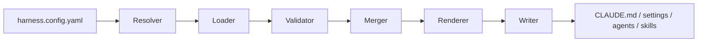

# Developer Internal Tooling — Configuration as Code

## Question

프로젝트마다 AI coding 설정을 복사하는 편이 더 단순한데, 언제 별도 내부도구를 만들 가치가 생기는가?

## At a glance

| | Summary |
|---|---|
| **Problem** | 여러 프로젝트의 AI coding 설정을 복제하면 중복과 drift가 발생 |
| **Decision** | 반복 비용이 생기는 경계만 typed module과 deterministic build로 공통화 |
| **Evidence** | `harness-kit` 공개 코드와 Node 22/24 검증 Workflow |

## Problem

프로젝트별 instruction, Hook, MCP, permission, Agent, Workflow, Skill 구성을 수동 복제하면 공통 규칙을 바꿀 때 여러 파일을 다시 수정해야 하고, 프로젝트마다 설정이 달라지는 configuration drift가 생깁니다.

```text
project A / CLAUDE.md + settings
project B / CLAUDE.md + settings
project C / CLAUDE.md + settings
              ↓
duplicate rules / missed updates / manual recovery
```

## Context / constraints

- 프로젝트마다 필요한 규칙과 환경 차이는 유지해야 함
- 공통 설정 변경은 재사용할 수 있어야 함
- 생성 결과가 사람이 읽고 되돌릴 수 있어야 함
- Hook·MCP·permission처럼 텍스트 규칙 밖의 설정도 포함
- 프로젝트가 1~2개이고 변경이 드물면 직접 편집이 더 단순함
- 공개 R&D이며 employer production adoption을 주장하지 않음

## Investigation

공통화 대상을 “AI 관련 파일 전체”로 잡지 않고 반복 변경 비용과 책임을 기준으로 나눴습니다.

| Configuration | Reuse candidate | Generated target |
|---|---|---|
| instruction | 공통 개발·운영 규칙 | `CLAUDE.md` |
| hook | format·test·security·commit guard | `.claude/settings.json` |
| MCP | 프로젝트별 server 조합 | `.claude/settings.json` |
| permission | allow / deny 규칙 | `.claude/settings.local.json` |
| agent | 역할별 지침 | `.claude/agents/*.md` |
| workflow | 반복 실행 절차 | `.claude/workflows/*.yaml` |
| skill | project command / procedure | `.claude/skills/*/SKILL.md` |

공통 모듈과 프로젝트 고유 설정, 환경별 profile을 분리해야 재사용이 실제로 이득이 됩니다.

## Decision

반복 비용이 확인된 경계만 typed module로 만들고, 설정 파일은 deterministic pipeline으로 생성합니다.



공통화가 목적이 아니라 **동일한 입력에서 재현 가능한 설정을 만들고, 변경 누락과 수동 복구 비용을 줄이는 것**이 목적입니다.

## Trade-off

추상화 자체도 비용입니다.

```text
1–2 projects + rare changes
→ direct editing

repeated shared changes + drift risk
→ modular build
```

도구를 도입하면 config schema, module 구조와 build 명령을 익혀야 하고 한 단계의 간접 레이어가 추가됩니다. 따라서 모든 프로젝트에 강제하지 않고 반복 비용이 실제로 나타나는 경우에만 사용합니다.

## Implementation

공개 저장소 `harness-kit`은 다음 요소를 포함합니다.

### 1. Typed configuration and validation

- TypeScript 기반 CLI
- Zod를 사용한 설정 검증
- project config와 module vars
- 조건부 module과 environment profile

### 2. Deterministic build pipeline

```text
resolve
→ load
→ validate
→ merge
→ render
→ write
```

- instruction·hook·MCP·permission·agent·workflow·skill 생성
- 자동생성 결과와 프로젝트 고유 block을 구분
- atomic write를 사용해 중간 실패 시 기존 결과를 보호
- build manifest로 생성 결과를 추적

### 3. Operational boundaries

- `build --dry-run`으로 변경 전 확인
- `doctor`로 환경 진단
- 프로젝트가 적으면 직접 편집을 권장
- npm package로 배포하지 않고 git clone + link 상태를 한계로 명시

## Verification / actual use

공개 GitHub Actions는 Node 22와 24에서 다음을 실행합니다.

```text
npm ci
→ npm audit --audit-level=high
→ TypeScript check
→ tests
→ build
→ built CLI smoke
```

기능 검증과 dependency audit을 별도 gate로 둡니다. 공개 코드와 CI는 구현과 재현 가능한 검증 방식을 보여주지만, 외부 사용자의 adoption이나 생산성 개선을 증명하지 않습니다.

## Limitations

이 Case가 증명하지 않는 범위:

- npm publication
- 외부 사용자·팀 채택
- employer production deployment
- organization-wide AI rule standardization
- 생산성·토큰·비용 개선 수치
- 모든 AI coding tool에 대한 범용 호환성

## Evidence

- [EV-HARNESS-KIT](../EVIDENCE.md#ev-harness-kit)
- Repository: <https://github.com/tomtomjskim/harness-kit>
- 관련 Role View: [AI-assisted Engineering / Internal Tools / AX](../PORTFOLIO-AX.md)

## Interview hooks

- 설정을 복사하면 되는데 왜 도구가 필요한가?
- abstraction 비용이 이득보다 커지는 시점은 언제인가?
- deterministic generation이 수동 템플릿보다 나은 이유는 무엇인가?
- 기능 검증과 dependency audit을 왜 분리했는가?
- 외부 채택이 없는데 포트폴리오 가치가 있는가?
