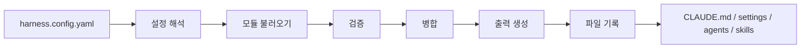

# 개발자 내부 도구 — 설정을 코드로 관리하기

## 핵심 질문

프로젝트마다 AI 코딩 도구 설정을 복사하는 편이 더 단순한데, 언제 별도 내부 도구를 만들 가치가 생기는가?

## 한눈에 보기

| 구분 | 요약 |
|---|---|
| **문제** | 여러 프로젝트의 AI 코딩 도구 설정을 복제하면 중복과 설정 불일치가 발생 |
| **판단** | 반복 비용이 생기는 경계만 타입이 정의된 모듈과 규칙 기반 생성으로 공통화 |
| **근거** | `harness-kit` 공개 코드와 Node 22/24 검증 흐름 |

## 문제

프로젝트별 지침, Hook, MCP, 권한, Agent, 작업 흐름, Skill 구성을 수동 복제하면 공통 규칙을 바꿀 때 여러 파일을 다시 수정해야 하고, 프로젝트마다 설정이 달라지는 문제가 생깁니다.

```text
프로젝트 A / CLAUDE.md + 설정
프로젝트 B / CLAUDE.md + 설정
프로젝트 C / CLAUDE.md + 설정
              ↓
중복 규칙 / 변경 누락 / 수동 복구
```

## 업무 환경과 제약

- 프로젝트마다 필요한 규칙과 환경 차이는 유지해야 함
- 공통 설정 변경은 재사용할 수 있어야 함
- 생성 결과가 사람이 읽고 되돌릴 수 있어야 함
- Hook·MCP·권한처럼 텍스트 지침 밖의 설정도 포함
- 프로젝트가 1~2개이고 변경이 드물면 직접 편집이 더 단순함
- 공개 연구·개발 자료이며 회사 운영 도입을 주장하지 않음

## 확인 과정

공통화 대상을 “AI 관련 파일 전체”로 잡지 않고 반복 변경 비용과 책임을 기준으로 나눴습니다.

| 설정 영역 | 공통화 대상 | 생성 파일 |
|---|---|---|
| 지침 | 공통 개발·운영 규칙 | `CLAUDE.md` |
| Hook | 포맷·테스트·보안·커밋 검사 | `.claude/settings.json` |
| MCP | 프로젝트별 서버 조합 | `.claude/settings.json` |
| 권한 | 허용·차단 규칙 | `.claude/settings.local.json` |
| Agent | 역할별 지침 | `.claude/agents/*.md` |
| 작업 흐름 | 반복 실행 절차 | `.claude/workflows/*.yaml` |
| Skill | 프로젝트 명령·절차 | `.claude/skills/*/SKILL.md` |

공통 모듈과 프로젝트 고유 설정, 환경별 프로필을 분리해야 재사용이 실제로 이득이 됩니다.

## 판단

반복 비용이 확인된 경계만 타입이 정의된 모듈로 만들고, 설정 파일은 규칙 기반 흐름으로 생성합니다.



공통화가 목적이 아니라 **동일한 입력에서 재현 가능한 설정을 만들고, 변경 누락과 수동 복구 비용을 줄이는 것**이 목적입니다.

## 선택 기준과 대안

추상화 자체도 비용입니다.

```text
프로젝트 1~2개 + 변경이 드묾
→ 직접 편집

공통 변경 반복 + 설정 불일치 위험
→ 모듈 기반 빌드
```

도구를 도입하면 설정 구조, 모듈 구성과 빌드 명령을 익혀야 하고 한 단계의 간접 레이어가 추가됩니다. 따라서 모든 프로젝트에 강제하지 않고 반복 비용이 실제로 나타나는 경우에만 사용합니다.

## 구현

공개 저장소 `harness-kit`은 다음 요소를 포함합니다.

### 1. 설정 구조와 검증

- TypeScript 기반 CLI
- Zod를 사용한 설정 검증
- 프로젝트 설정과 모듈 변수
- 조건부 모듈과 환경별 프로필

### 2. 규칙 기반 생성 흐름

```text
설정 해석
→ 모듈 불러오기
→ 검증
→ 병합
→ 출력 생성
→ 파일 기록
```

- 지침·Hook·MCP·권한·Agent·작업 흐름·Skill 생성
- 자동 생성 결과와 프로젝트 고유 내용을 구분
- 원자적 파일 쓰기로 중간 실패 시 기존 결과 보호
- 빌드 결과 목록으로 생성 파일 추적

### 3. 운영 경계

- `build --dry-run`으로 변경 전 확인
- `doctor`로 환경 진단
- 프로젝트가 적으면 직접 편집을 권장
- npm 패키지로 배포하지 않고 git clone + link 상태를 한계로 명시

## 검증과 실제 사용

공개 GitHub Actions는 Node 22와 24에서 다음을 실행합니다.

```text
npm ci
→ npm audit --audit-level=high
→ TypeScript 검사
→ 테스트
→ 빌드
→ CLI 기본 실행 확인
```

기능 검증과 의존성 보안 점검을 별도 기준으로 둡니다. 공개 코드와 CI는 구현과 재현 가능한 검증 방식을 보여주지만, 외부 사용자의 도입이나 생산성 개선을 증명하지 않습니다.

## 한계

이 사례가 증명하지 않는 범위:

- npm 배포
- 외부 사용자·팀 채택
- 회사 운영 환경 배포
- 조직 전체 AI 규칙 표준화
- 생산성·토큰·비용 개선 수치
- 모든 AI 코딩 도구에 대한 범용 호환성

## 근거

- [EV-HARNESS-KIT](../EVIDENCE.md#ev-harness-kit)
- 저장소: <https://github.com/tomtomjskim/harness-kit>
- 관련 관점: [AI 활용·내부 도구](../PORTFOLIO-AX.md)

## 면접 예상 질문

- 설정을 복사하면 되는데 왜 도구가 필요한가?
- 추상화 비용이 이득보다 커지는 시점은 언제인가?
- 규칙 기반 생성이 수동 템플릿보다 나은 이유는 무엇인가?
- 기능 검증과 의존성 보안 점검을 왜 분리했는가?
- 외부 채택이 없는데 포트폴리오 가치가 있는가?
