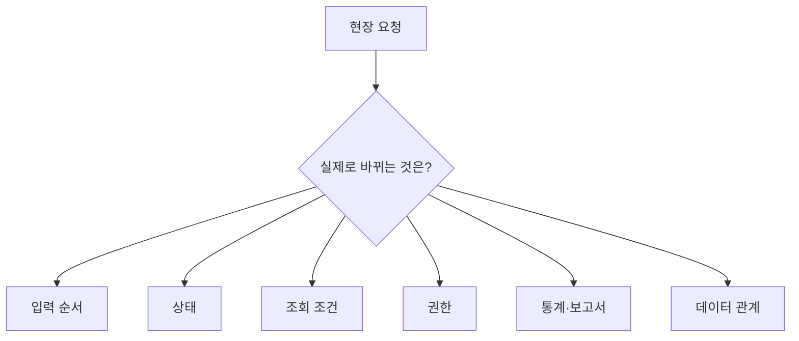

# 제조 MES — 현장 요청을 시스템 규칙으로 바꾸기

## 핵심 질문

“화면을 바꿔 달라”는 현장 요청이 실제로는 입력 순서·상태·조회·통계·권한·DB 관계의 변경일 때, 무엇을 기준으로 시스템 요구사항을 정의할 것인가?

## 한눈에 보기

| 구분 | 요약 |
|---|---|
| **문제** | “화면 변경” 요청이 상태·조회·통계·권한 규칙을 숨김 |
| **판단** | 실제 작업 순서를 시스템 조건으로 분해 |
| **근거** | 비식별화한 실무 사례와 현장 도입·지원 범위 |

## 문제

MES 요청은 화면 문장으로 들어와도 실제 변경 범위는 업무 순서와 데이터 정의까지 포함할 수 있습니다.



요청 문장을 그대로 화면 작업으로 바꾸면 저장 규칙, 조회 기준, 통계와 현장 작업 순서가 서로 달라질 수 있습니다.

## 업무 환경과 제약

- PHP/MySQL 기반 MES·업무시스템
- 생산·공정·품질·재고 도메인
- 고객별 업무 차이와 장기 운영 중 누적된 규칙
- 현장 도입·교육·원격지원
- 계정·네트워크·프린터·장비 등 애플리케이션 밖의 환경
- 고객사·공장·생산 데이터와 내부 제품 구조는 비공개

## 확인 과정

먼저 “누가, 어느 작업에서, 무엇을 판단하기 위해” 요청했는지 확인합니다.

```text
현장 요청
→ 실제 작업 흐름
→ 사용자·발생 시점
→ 입력·조회 조건
→ 상태 규칙
→ 통계·보고서
→ 권한
→ 데이터 관계
→ 화면·DB 변경 범위
```

현장에서 “시스템이 안 된다”는 보고도 같은 방식으로 계층을 나눕니다.

```text
문제 보고
→ 애플리케이션·DB·상태 재현
→ 계정·권한
→ 네트워크·프린터·장비
→ 사용자 설정과 작업 순서
```

코드를 먼저 수정하지 않고 어떤 계층에서 문제가 재현되는지 좁힙니다.

## 판단

요구 문장을 바로 화면 작업으로 만들지 않고 **실제 작업 순서를 명시적인 시스템 조건으로 바꾼 뒤 화면과 DB 변경 범위를 함께 정합니다.**

- 입력 시점과 필수값
- 조회 대상과 기간·조건
- 상태 전이와 완료 조건
- 통계·보고서의 기준 데이터
- 사용자 역할과 허용 동작
- 저장·조회 테이블의 관계
- 현장 환경과 애플리케이션 책임 경계

## 선택 기준과 대안

장기 운영 MES에서는 항상 전면 재작성이 정답이 아닙니다.

```text
기존 동작
→ 코드·데이터 관계
→ 숨은 업무 규칙
→ 반복 위험이 큰 경계
→ 작은 단위로 분리
→ 회귀 확인
→ 필요할 때만 더 큰 구조 개선
```

전면 교체는 숨은 업무 규칙, 데이터 이관, 사용자 교육, 장비 연결과 운영 중단 비용을 함께 키울 수 있습니다. 반대로 반복 오류와 변경 비용이 큰 경계를 계속 방치하지 않고, 테스트 가능하고 영향 범위를 좁힐 수 있는 단위부터 개선합니다.

## 구현

공개 가능한 구현 방식은 다음과 같습니다.

### 1. 화면과 데이터 규칙을 함께 설계

요청을 다음 범위로 분리해 구현 대상과 회귀 범위를 정합니다.

```text
화면 입력·동작
+ 조회 조건
+ 상태 전이
+ 권한
+ 통계·보고서 규칙
+ DB 관계
```

특정 화면만 바뀌어도 저장값·조회 결과·보고서가 같은 기준을 사용하는지 확인합니다.

### 2. 문제 계층을 분리한 지원

- 동일 계정·데이터로 애플리케이션·DB에서 재현
- 권한과 기초정보 확인
- 네트워크·프린터·장비 연결 확인
- 현장 설정과 사용자 작업 순서 확인
- 원인이 좁혀진 뒤 코드·데이터·환경 중 맞는 조치 수행

### 3. 점진적 개선

기존 동작을 회귀 기준으로 유지하면서 반복되는 조건과 책임을 기능 단위로 분리합니다. 전체 제품을 한 번에 재작성했다고 주장하지 않습니다.

## 검증과 실제 사용

MES 개발뿐 아니라 현장 도입·교육·원격지원 과정에서 실제 작업 흐름을 확인했습니다.

- 사용자 입력과 상태 변화가 현장 순서와 맞는지 확인
- 조회·통계·보고서가 합의한 기준을 사용하는지 확인
- 사용자 역할과 환경 조건을 함께 확인
- 애플리케이션 문제와 현장 환경 문제를 구분
- 변경 후 현업 피드백을 다시 시스템 조건으로 정리

현재 공개 자료는 대표 고객사 한 곳의 구체 화면이나 검수 결과를 노출하지 않습니다.

## 한계

이 사례가 증명하지 않는 범위:

- 전체 MES 제품 책임
- 약 100개 고객사를 단독 구축했다는 주장
- 모든 고객사의 구조와 업무 규칙이 동일하다는 주장
- 공장·생산·품질 원본 데이터
- 클라우드 SaaS 경험으로의 확대
- 생산성·SLA·불량률 개선 수치
- 공개 가능한 단일 현장 장애의 상세 결과

## 근거

- [EV-CAREER-MES](../EVIDENCE.md#ev-career-mes)
- 관련 관점: [백엔드 개발 포트폴리오](../PORTFOLIO.md)
