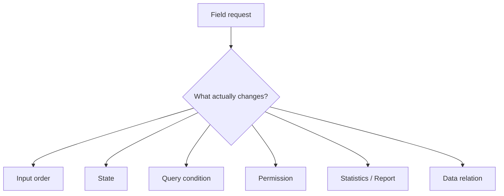

# Manufacturing MES — Field Request to System Rules

## Problem

MES의 요청은 “화면을 바꿔 달라”는 문장으로 들어와도 실제 변경 범위는 업무 순서와 데이터 정의까지 포함할 수 있습니다.



## Decision

요구 문장을 바로 UI task로 바꾸지 않고 실제 작업 순서를 시스템 조건으로 분해합니다.

```text
field request
→ actual workflow
→ input / query condition
→ state rule
→ statistics / report
→ permission
→ screen + DB scope
```

## Why

이렇게 분해하면 화면 문제처럼 보이는 요청이 실제로는 상태 정의, 조회 조건, 데이터 저장, 권한 중 어디에 있는지 구분할 수 있습니다.

## Troubleshooting boundary

현장에서 “시스템이 안 된다”는 보고가 항상 application bug인 것은 아닙니다.

```text
reported failure
→ application / DB / state 재현 여부
→ account / permission
→ network / printer / device
→ operator configuration
```

코드를 먼저 고치기보다 문제 계층을 먼저 구분합니다.

## Trade-off

장기 운영 PHP 시스템에서는 항상 rewrite가 답이 아닙니다.

```text
기존 동작 이해
→ code/data 관계 확인
→ 위험·중복 경계 식별
→ 작은 변경으로 격리
→ 기존 업무 동작 보존
→ 필요한 부분만 구조 개선
```

## Demonstrates

- 현업 요구를 상태·조회·권한·DB 조건으로 분해
- 제조 workflow와 system state를 함께 보는 모델링
- software/data와 local environment 문제를 분리하는 지원 방식
- legacy business system에서 incremental change를 선택하는 판단

## Does not prove

- 전체 MES 제품 ownership
- 모든 고객사 architecture가 동일했다는 주장
- 공개할 수 없는 공장·생산 데이터
- cloud-native SaaS 경험으로의 확대
- 정량 성과나 SLA
