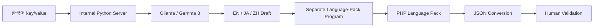

# Practical AI Automation — Local LLM + Verification Boundary

## Question

AI를 사용할 수 있는 업무라고 해서 전부 AI에 맡겨야 하는가? 자연어 처리, 일반 코드, 사람 검수의 책임을 어디서 나눌 것인가?

## At a glance

| | Summary |
|---|---|
| **Problem** | 번역·복사·언어팩 반영이 반복되고 소형 모델에 한계가 있음 |
| **Decision** | 자연어는 Local LLM, 파일 변환은 일반 코드, 최종 판단은 사람 |
| **Evidence** | 실제 반복 사용한 언어팩 Workflow와 공개 검증 원칙 |

## Problem

다국어 UI 언어팩 작업에서 다음 조작을 언어별로 반복해야 했습니다.

```text
한국어 문장 확인
→ 언어별 번역기 실행
→ 결과 복사
→ 코드 입력
→ PHP 언어팩 반영
→ JSON 변환
```

문제는 번역 품질뿐 아니라 사람이 같은 조작을 계속 반복해야 한다는 점이었습니다.

## Context / constraints

- 전용 GPU가 없는 내부 개발 PC
- CPU inference
- Gemma 3 계열 소형 모델
- 문장별 처리 속도와 번역 품질의 한계
- 언어팩 구조는 정확히 보존해야 함
- 결과를 사람이 확인해야 함
- 번역 서버 source와 내부 경로는 비공개

## Investigation

업무를 하나의 “AI 번역 문제”로 보지 않고 출력의 성격에 따라 나눴습니다.

| Work | Output characteristic | Better default |
|---|---|---|
| 자연어 번역 | 복수의 합리적 표현과 문맥 판단 | LLM draft |
| key/value 보존 | 규칙이 명확하고 동일 입력은 같은 구조 필요 | deterministic code |
| PHP 파일 생성 | 포맷과 escaping 규칙이 명확 | deterministic code |
| JSON 변환 | 정확한 구조 변환 | deterministic code |
| 오역·문맥·최종 반영 | 업무 책임과 판단 필요 | human validation |

## Decision

자연어 번역과 파일 생성을 같은 모델에 맡기지 않았습니다.



- **LLM:** 영어·일본어·중국어 번역 초안
- **Deterministic program:** key/value 구조를 받아 PHP 언어팩을 만들고 JSON으로 변환
- **Human:** 번역 맥락과 오역 확인, 최종 반영 판단

## Trade-off

소형 로컬 모델은 문장 하나에 수십 초가 걸릴 수 있었고 일부 결과는 다시 확인해야 했습니다. 순수 inference latency만 보면 빠르지 않았습니다.

다만 사람이 언어별 번역기·복사·코드 입력을 순차 반복하는 대신, 초안 생성을 다른 작업과 병렬로 진행하고 파일 변환은 프로그램에 맡길 수 있었습니다.

도입 전 baseline을 남기지 않았으므로 생산성 향상률, 정확도, 비용 절감률은 주장하지 않습니다.

## Implementation

### 1. Local draft generation

- Python 서버가 Ollama를 호출
- 한국어 key/value를 입력
- 영어·일본어·중국어 초안 생성
- 전용 GPU 없이 내부 PC에서 실행

### 2. Deterministic language-pack generation

Ollama 호출과 파일 생성은 별도 책임으로 분리했습니다.

```text
translation draft
→ PHP language-pack generation
→ JSON conversion
```

모델이 파일 구조를 임의로 생성하도록 두지 않고, 규칙이 명확한 단계는 일반 프로그램이 담당합니다.

### 3. Human fallback

소형 모델의 오역이나 문맥이 어색한 결과는 사람이 수정하고 최종 반영합니다. 완전 자동 번역 품질을 전제로 하지 않습니다.

## Verification / actual use

- 프론트 개발자가 실제 언어팩 작업에서 반복 사용
- 번역 결과를 사람이 확인한 뒤 반영
- PHP 언어팩 생성과 JSON 변환을 모델의 자연어 출력과 분리
- Agent 개발 Workflow에서도 모델의 완료 보고와 실제 실행 결과를 분리
- 회사 실무의 모든 단계가 CI에서 자동 강제됐다고 주장하지 않음

현재 공개 근거만으로는 placeholder·HTML tag·줄바꿈 보존을 별도 validator로 자동화했다고 말할 수 없습니다. 이 항목은 향후 source 확인이 필요한 세부 범위입니다.

## Limitations

이 Case가 증명하지 않는 범위:

- company-wide AX platform ownership
- production RAG·model serving·fine-tuning 경험
- GPU inference platform 운영
- 번역 품질 보장 또는 정확도 수치
- 생산성·비용 절감률
- 번역 Python 서버의 공개 source
- AI가 업무 정책·상태·production deploy를 단독 결정

## Evidence

- [EV-LOCAL-I18N](../EVIDENCE.md#ev-local-i18n)
- [EV-CODEX-WORKFLOW](../EVIDENCE.md#ev-codex-workflow)
- [EV-STACKFORGE](../EVIDENCE.md#ev-stackforge)
- 관련 Role View: [AI-assisted Engineering / Internal Tools / AX](../PORTFOLIO-AX.md)

## Interview hooks

- 왜 외부 번역 API가 아니라 로컬 모델을 사용했는가?
- GPU가 없고 처리 속도가 느렸는데 실제 가치가 있었는가?
- 왜 PHP/JSON 변환까지 LLM에 맡기지 않았는가?
- 오역과 최종 반영 책임은 누가 가졌는가?
- 모델 응답과 완료 Evidence를 어떻게 구분하는가?
