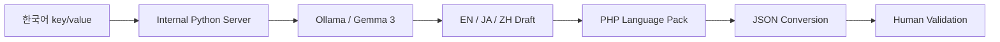

# Practical AI Automation — Local LLM + Verification Boundary

## Question

AI를 사용할 수 있는 업무라고 해서 전부 AI에 맡겨야 하는가? 자연어 처리, 결정론적 변환, 사람 검수를 어디서 나눌 것인가?

## Problem

다국어 UI 언어팩 작업에서 다음 반복이 발생했습니다.

```text
한국어 문장 확인
→ 언어별 번역기 실행
→ 결과 복사
→ 코드 입력
→ 언어마다 반복
→ PHP / JSON 언어팩 반영
```

문제는 번역 품질뿐 아니라 사람이 같은 조작을 계속 반복해야 한다는 점이었습니다.

## Constraints

- 전용 GPU 없음
- 내부 개발 PC의 CPU inference
- Gemma 3 계열 소형 모델
- 문장별 처리 속도와 번역 품질 한계
- 결과를 사람이 확인해야 함

## Decision

자연어 번역과 파일 변환을 같은 문제로 취급하지 않았습니다.



### LLM responsibility

- 자연어 번역 초안

### Deterministic program responsibility

- key/value 구조 보존
- PHP 언어팩 생성
- JSON 변환

### Human responsibility

- 번역 맥락 확인
- 소형 모델 오역 검수
- 최종 반영 판단

## Actual use

프론트 개발자가 실제 언어팩 업무에서 반복 사용했습니다. 다만 아래는 측정하지 않았으므로 주장하지 않습니다.

- 생산성 향상률
- 번역 정확도 %
- 비용 절감률
- 처리량 benchmark

## Verification boundary

코딩 Agent에도 같은 원칙을 적용합니다.

```text
Model response != Completion evidence
```

Agent가 test skip, fail, not_run을 충분히 보고하지 않는 문제를 경험한 뒤 실제 실행 결과와 체크리스트를 완료 판단 기준에 포함했습니다.

```text
Problem / Scope
→ AI-assisted analysis / implementation
→ Static / Test / CI
→ Independent review
→ Human acceptance
```

## External API boundary

LLM은 공식 API 문서의 source of truth를 대체하지 않습니다.

```text
official docs
→ LLM comparison / candidate mapping
→ actual request / response
→ docs 재대조
→ developer final decision
```

## Public supporting evidence

- <https://github.com/tomtomjskim/codex-workflow-skills>
- <https://github.com/tomtomjskim/stackforge-atlas>
- <https://github.com/tomtomjskim/harness-kit>

## Does not prove

- company-wide AX platform ownership
- production RAG / model serving
- model training / fine-tuning expertise
- GPU inference platform 운영
- 번역 품질 보장
- AI 사용으로 생산성 N% 향상
- AI가 업무 정책이나 production deploy를 단독 결정
